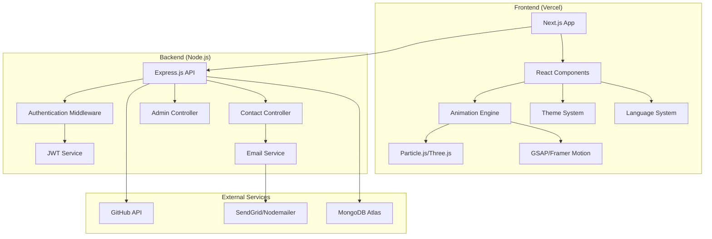

# Design Document: Lewis Portfolio Website

## Overview

The Lewis Portfolio Website (mwangilewis.com) is a next-generation developer portfolio built with modern web technologies. The system features a futuristic design with animated backgrounds, multilingual support, secure admin dashboard, and GitHub integration. The architecture follows a full-stack approach with React.js/Next.js frontend, Node.js/Express.js backend, and MongoDB database.

## Architecture

### System Architecture



### Technology Stack

**Frontend:**
- Next.js 14 with App Router for SSR/SSG capabilities
- React 18 with TypeScript for type safety
- Tailwind CSS for utility-first styling
- Framer Motion for complex animations
- Three.js for 3D particle backgrounds
- i18next for internationalization
- Axios for API communication

**Backend:**
- Node.js with Express.js framework
- MongoDB with Mongoose ODM
- JWT for authentication
- bcrypt for password hashing
- Helmet.js for security headers
- Express-rate-limit for rate limiting
- Express-validator for input validation

**Deployment:**
- Frontend: Vercel with automatic deployments
- Backend: Railway or Render for API hosting
- Database: MongoDB Atlas cloud database

## Components and Interfaces

### Frontend Components

#### Core Layout Components

**AppLayout Component**
```typescript
interface AppLayoutProps {
  children: React.ReactNode;
  showNavigation?: boolean;
  theme: 'light' | 'dark';
}

const AppLayout: React.FC<AppLayoutProps> = ({ children, showNavigation = true, theme }) => {
  // Handles global layout, navigation, and theme context
}
```

**Navigation Component**
```typescript
interface NavigationProps {
  currentPath: string;
  language: string;
  onLanguageChange: (lang: string) => void;
  onThemeToggle: () => void;
}

const Navigation: React.FC<NavigationProps> = ({ currentPath, language, onLanguageChange, onThemeToggle }) => {
  // Responsive navigation with language toggle and theme switcher
}
```

#### Animation Components

**ParticleBackground Component**
```typescript
interface ParticleBackgroundProps {
  theme: 'light' | 'dark';
  intensity: number;
  colorScheme: string[];
}

const ParticleBackground: React.FC<ParticleBackgroundProps> = ({ theme, intensity, colorScheme }) => {
  // Three.js particle system with dynamic color changes
}
```

**AnimatedSection Component**
```typescript
interface AnimatedSectionProps {
  children: React.ReactNode;
  animation: 'fadeIn' | 'slideUp' | 'scaleIn';
  delay?: number;
  trigger?: 'scroll' | 'hover' | 'immediate';
}

const AnimatedSection: React.FC<AnimatedSectionProps> = ({ children, animation, delay, trigger }) => {
  // GSAP-powered section animations with intersection observer
}
```

#### Content Components

**SkillBar Component**
```typescript
interface SkillBarProps {
  skill: string;
  percentage: number;
  color?: string;
  animated?: boolean;
}

const SkillBar: React.FC<SkillBarProps> = ({ skill, percentage, color, animated }) => {
  // Animated progress bar with percentage display
}
```

**ProjectCard Component**
```typescript
interface ProjectCardProps {
  project: {
    id: string;
    name: string;
    description: string;
    technologies: string[];
    githubUrl?: string;
    liveUrl?: string;
    image?: string;
  };
  onHover?: () => void;
}

const ProjectCard: React.FC<ProjectCardProps> = ({ project, onHover }) => {
  // Interactive project card with hover animations
}
```

**Timeline Component**
```typescript
interface TimelineItem {
  id: string;
  title: string;
  organization: string;
  period: string;
  description: string;
  type: 'work' | 'education';
}

interface TimelineProps {
  items: TimelineItem[];
  variant: 'vertical' | 'horizontal';
}

const Timeline: React.FC<TimelineProps> = ({ items, variant }) => {
  // Animated timeline for experience and education
}
```

#### Form Components

**ContactForm Component**
```typescript
interface ContactFormData {
  name: string;
  email: string;
  message: string;
}

interface ContactFormProps {
  onSubmit: (data: ContactFormData) => Promise<void>;
  loading?: boolean;
}

const ContactForm: React.FC<ContactFormProps> = ({ onSubmit, loading }) => {
  // Validated contact form with toast notifications
}
```

### Backend API Interfaces

#### Authentication Endpoints

```typescript
// POST /api/auth/login
interface LoginRequest {
  email: string;
  password: string;
}

interface LoginResponse {
  success: boolean;
  token?: string;
  user?: {
    email: string;
    role: 'admin';
  };
  message: string;
}
```

#### Contact Endpoints

```typescript
// POST /api/contact
interface ContactRequest {
  name: string;
  email: string;
  message: string;
}

interface ContactResponse {
  success: boolean;
  message: string;
  id?: string;
}

// GET /api/admin/contacts
interface ContactsResponse {
  success: boolean;
  contacts: Array<{
    _id: string;
    name: string;
    email: string;
    message: string;
    createdAt: Date;
    read: boolean;
  }>;
}
```

#### GitHub Integration Endpoints

```typescript
// GET /api/github/repos
interface GitHubReposResponse {
  success: boolean;
  repos: Array<{
    id: number;
    name: string;
    description: string;
    html_url: string;
    language: string;
    stargazers_count: number;
    updated_at: string;
  }>;
}
```

### Service Interfaces

#### Email Service

```typescript
interface EmailService {
  sendContactNotification(contactData: ContactFormData): Promise<boolean>;
  sendAdminNotification(message: string): Promise<boolean>;
}

class NodemailerService implements EmailService {
  private transporter: nodemailer.Transporter;
  
  async sendContactNotification(contactData: ContactFormData): Promise<boolean> {
    // Send email notification for new contact form submission
  }
}
```

#### GitHub Service

```typescript
interface GitHubService {
  fetchPinnedRepos(username: string): Promise<GitHubRepo[]>;
  fetchUserProfile(username: string): Promise<GitHubProfile>;
}

class GitHubAPIService implements GitHubService {
  private apiKey: string;
  
  async fetchPinnedRepos(username: string): Promise<GitHubRepo[]> {
    // Fetch pinned repositories from GitHub API
  }
}
```

## Data Models

### Database Schemas

#### User Contact Schema

```typescript
interface UserContact {
  _id: ObjectId;
  name: string;
  email: string;
  message: string;
  createdAt: Date;
  read: boolean;
  ipAddress?: string;
}

const ContactSchema = new mongoose.Schema({
  name: {
    type: String,
    required: true,
    trim: true,
    maxlength: 100
  },
  email: {
    type: String,
    required: true,
    trim: true,
    lowercase: true,
    validate: [validator.isEmail, 'Invalid email address']
  },
  message: {
    type: String,
    required: true,
    trim: true,
    maxlength: 1000
  },
  createdAt: {
    type: Date,
    default: Date.now
  },
  read: {
    type: Boolean,
    default: false
  },
  ipAddress: {
    type: String,
    required: false
  }
});
```

#### Admin User Schema

```typescript
interface AdminUser {
  _id: ObjectId;
  email: string;
  password: string;
  role: 'admin';
  lastLogin?: Date;
  createdAt: Date;
}

const AdminSchema = new mongoose.Schema({
  email: {
    type: String,
    required: true,
    unique: true,
    trim: true,
    lowercase: true,
    validate: [validator.isEmail, 'Invalid email address']
  },
  password: {
    type: String,
    required: true,
    minlength: 8
  },
  role: {
    type: String,
    enum: ['admin'],
    default: 'admin'
  },
  lastLogin: {
    type: Date
  },
  createdAt: {
    type: Date,
    default: Date.now
  }
});
```

### Frontend Data Models

#### Portfolio Content Model

```typescript
interface PortfolioContent {
  personal: {
    name: string;
    title: string;
    email: string;
    phone: string;
    location: string;
    bio: string;
    avatar: string;
  };
  skills: Array<{
    name: string;
    percentage: number;
    category: 'technical' | 'soft' | 'tools';
  }>;
  experience: Array<{
    title: string;
    organization: string;
    period: string;
    description: string;
    type: 'work' | 'volunteer';
  }>;
  education: Array<{
    degree: string;
    institution: string;
    period: string;
    description?: string;
  }>;
  projects: Array<{
    name: string;
    description: string;
    technologies: string[];
    githubUrl?: string;
    liveUrl?: string;
    image?: string;
    featured: boolean;
  }>;
}
```

#### Theme Configuration Model

```typescript
interface ThemeConfig {
  light: {
    primary: string;
    secondary: string;
    background: string;
    surface: string;
    text: string;
    accent: string;
  };
  dark: {
    primary: string;
    secondary: string;
    background: string;
    surface: string;
    text: string;
    accent: string;
  };
  animations: {
    duration: number;
    easing: string;
    particleCount: number;
  };
}

const defaultTheme: ThemeConfig = {
  light: {
    primary: '#E63946',
    secondary: '#FFFFFF',
    background: '#FFFFFF',
    surface: '#F8F9FA',
    text: '#212529',
    accent: '#FFC107'
  },
  dark: {
    primary: '#E63946',
    secondary: '#1A1A1A',
    background: '#121212',
    surface: '#1E1E1E',
    text: '#FFFFFF',
    accent: '#FFC107'
  },
  animations: {
    duration: 300,
    easing: 'ease-in-out',
    particleCount: 100
  }
};
```

Now I need to use the prework tool to analyze the acceptance criteria before writing the Correctness Properties section:

<function_calls>
<invoke name="prework">
<parameter name="featureName">lewis-portfolio-website
## Correctness Properties

*A property is a characteristic or behavior that should hold true across all valid executions of a system—essentially, a formal statement about what the system should do. Properties serve as the bridge between human-readable specifications and machine-verifiable correctness guarantees.*

Based on the prework analysis, I've identified several redundant properties that can be consolidated:

**Property Reflection:**
- Properties related to data validation (7.4, 7.6, 10.3) can be combined into a comprehensive input validation property
- Properties about database schema validation (10.1, 10.2) can be combined into a single schema compliance property
- Animation properties (2.3, 2.5) can be consolidated into a general interaction feedback property
- Security header properties (7.1, 7.5) can be combined into a comprehensive security headers property

### Core System Properties

**Property 1: Theme Color Consistency**
*For any* UI element in the portfolio system, the applied colors should match the defined theme color scheme (#E63946 for primary red, #FFFFFF for white background in light mode)
**Validates: Requirements 1.1**

**Property 2: Theme Transition Completeness**
*For any* theme toggle action, all UI elements should transition to the new theme variant within the specified animation duration
**Validates: Requirements 1.2**

**Property 3: Interactive Animation Response**
*For any* user interaction with UI elements (hover, click, focus), the animation engine should provide appropriate visual feedback through transforms or animations
**Validates: Requirements 1.4, 2.5**

**Property 4: Particle System Functionality**
*For any* page load or navigation event, the particle background system should initialize and render animated particles
**Validates: Requirements 2.1**

**Property 5: Dynamic Background Color Changes**
*For any* scroll or navigation event, the background color should change dynamically based on the current scroll position or page
**Validates: Requirements 2.2**

**Property 6: Image Hover Transformations**
*For any* individual image element on the page, hovering should apply scale, glow, and tilt CSS transformations to that specific image without affecting other images
**Validates: Requirements 2.3**

**Property 7: Smooth Scrolling Implementation**
*For any* scroll event, the scrolling behavior should be smooth and animated rather than instant
**Validates: Requirements 2.4**

### Language System Properties

**Property 8: Language Support Completeness**
*For any* language selection (English, Swahili, French), the system should have corresponding translation files and display the language option
**Validates: Requirements 3.1**

**Property 9: Language Content Updates**
*For any* language change event, all static text content should immediately update to the selected language
**Validates: Requirements 3.2**

**Property 10: Translation File Structure**
*For any* supported language, the system should use properly structured JSON i18n files for translation management
**Validates: Requirements 3.3**

**Property 11: Language Preference Persistence**
*For any* language selection, the preference should persist across browser sessions and page refreshes
**Validates: Requirements 3.4**

**Property 12: Language Toggle Accessibility**
*For any* page in the portfolio, the language toggle control should be present and accessible
**Validates: Requirements 3.5**

### Authentication and Security Properties

**Property 13: Password Security Implementation**
*For any* password storage operation, the password should be hashed using bcrypt before database storage
**Validates: Requirements 4.6**

**Property 14: JWT Token Management**
*For any* successful authentication, the system should generate and manage JWT tokens for secure session handling
**Validates: Requirements 4.5**

**Property 15: Admin Dashboard Data Display**
*For any* contact form submission in the database, it should appear in the admin dashboard with all relevant information
**Validates: Requirements 4.2**

**Property 16: Admin CRUD Operations**
*For any* user entry in the admin dashboard, edit and delete operations should successfully modify or remove the data
**Validates: Requirements 4.3**

**Property 17: Dynamic Content Updates**
*For any* content modification through the admin dashboard, changes should be reflected in the live portfolio
**Validates: Requirements 4.4**

### Contact System Properties

**Property 18: Contact Form Data Capture**
*For any* contact form submission with valid data, all fields (name, email, message) should be captured and stored
**Validates: Requirements 5.1**

**Property 19: Email Notification Delivery**
*For any* contact form submission, an email notification should be sent via the configured email service
**Validates: Requirements 5.2**

**Property 20: User Feedback Notifications**
*For any* contact form submission, toast notifications should appear to provide user feedback on the submission status
**Validates: Requirements 5.3**

**Property 21: Mobile Click-to-Call Functionality**
*For any* mobile device access, the click-to-call button should be present and functional
**Validates: Requirements 5.4**

**Property 22: Contact Data Persistence**
*For any* contact form submission, the data should be stored in the database with accurate timestamps
**Validates: Requirements 5.5**

### GitHub Integration Properties

**Property 23: GitHub Repository Fetching**
*For any* GitHub API call, pinned repositories should be successfully fetched and returned with complete data
**Validates: Requirements 6.1**

**Property 24: Live GitHub Data Updates**
*For any* projects section display, the content should reflect current GitHub repository data
**Validates: Requirements 6.2**

**Property 25: GitHub API Fallback Behavior**
*For any* GitHub API failure or unavailability, cached project information should be displayed instead
**Validates: Requirements 6.3**

**Property 26: Repository Information Completeness**
*For any* displayed GitHub repository, all required information (name, description, language, star count) should be present
**Validates: Requirements 6.4**

**Property 27: Periodic GitHub Data Refresh**
*For any* specified time interval, the system should automatically refresh GitHub repository data
**Validates: Requirements 6.5**

### Security Properties

**Property 28: Comprehensive Security Headers**
*For any* HTTP response, appropriate security headers should be present including those provided by Helmet.js and secure cookie attributes
**Validates: Requirements 7.1, 7.5**

**Property 29: CORS Policy Enforcement**
*For any* cross-origin request, CORS policies should be properly enforced to restrict unauthorized access
**Validates: Requirements 7.2**

**Property 30: Rate Limiting Protection**
*For any* series of rapid requests from the same source, rate limiting should prevent abuse by blocking excessive requests
**Validates: Requirements 7.3**

**Property 31: Comprehensive Input Validation**
*For any* user input across the system, data should be sanitized and validated to prevent injection attacks and ensure data integrity
**Validates: Requirements 7.4, 7.6, 10.3**

### Content and Performance Properties

**Property 32: Skills Progress Bar Animation**
*For any* skills display, progress bars should be animated and accurately represent proficiency percentages
**Validates: Requirements 8.2**

**Property 33: Timeline Format Consistency**
*For any* experience or education data, the information should be displayed in a consistent timeline format
**Validates: Requirements 8.3, 8.5**

**Property 34: Responsive Design Compliance**
*For any* screen size (desktop, tablet, mobile), the portfolio should maintain full functionality and appropriate layout
**Validates: Requirements 9.1**

**Property 35: Performance Load Time**
*For any* page load under standard internet conditions, the portfolio should load within 3 seconds
**Validates: Requirements 9.2**

**Property 36: Animation Performance Maintenance**
*For any* supported device, animations should maintain smooth 60fps performance
**Validates: Requirements 9.3**

**Property 37: Performance Graceful Degradation**
*For any* lower-performance device, animations should gracefully degrade while maintaining functionality
**Validates: Requirements 9.4**

**Property 38: SEO Optimization Compliance**
*For any* page in the portfolio, proper meta tags and structured data should be present for search engine optimization
**Validates: Requirements 9.5**

### Database Properties

**Property 39: Database Schema Compliance**
*For any* database collection (Users, Admin), the schema should match the defined structure with proper field types and validation
**Validates: Requirements 10.1, 10.2**

**Property 40: Query Performance Optimization**
*For any* admin dashboard operation, database queries should execute efficiently with proper indexing
**Validates: Requirements 10.4, 10.5**

## Error Handling

### Frontend Error Handling

**Network Errors:**
- API request failures should display user-friendly error messages
- Implement retry mechanisms for transient failures
- Graceful degradation when external services are unavailable

**Animation Errors:**
- Fallback to CSS animations if JavaScript animations fail
- Performance monitoring to disable heavy animations on low-end devices
- Error boundaries to prevent animation failures from crashing the app

**Form Validation Errors:**
- Real-time validation with clear error messages
- Prevent form submission with invalid data
- Accessibility-compliant error announcements

### Backend Error Handling

**Authentication Errors:**
- Invalid credentials should return appropriate HTTP status codes
- JWT token expiration should trigger re-authentication
- Rate limiting should prevent brute force attacks

**Database Errors:**
- Connection failures should be logged and retried
- Data validation errors should return descriptive messages
- Backup mechanisms for critical data operations

**External API Errors:**
- GitHub API failures should fall back to cached data
- Email service failures should be logged and queued for retry
- Timeout handling for all external service calls

### Security Error Handling

**Input Validation:**
- Malicious input should be sanitized and logged
- SQL injection attempts should be blocked and reported
- XSS attempts should be prevented through proper escaping

**Access Control:**
- Unauthorized access attempts should be logged
- Admin routes should be protected with proper authentication
- Session hijacking attempts should be detected and prevented

## Testing Strategy

### Dual Testing Approach

The testing strategy employs both unit testing and property-based testing to ensure comprehensive coverage:

**Unit Tests:**
- Focus on specific examples, edge cases, and error conditions
- Test individual components and functions in isolation
- Verify integration points between system components
- Cover specific user scenarios and business logic

**Property-Based Tests:**
- Verify universal properties across all possible inputs
- Use randomized input generation to discover edge cases
- Validate system behavior under various conditions
- Ensure correctness properties hold for all valid inputs

### Property-Based Testing Configuration

**Testing Framework:** 
- Frontend: Jest with fast-check for property-based testing
- Backend: Jest with fast-check for Node.js property testing

**Test Configuration:**
- Minimum 100 iterations per property test
- Each property test references its corresponding design document property
- Tag format: **Feature: lewis-portfolio-website, Property {number}: {property_text}**

**Example Property Test Structure:**
```typescript
describe('Theme System Properties', () => {
  test('Property 1: Theme Color Consistency', () => {
    // Feature: lewis-portfolio-website, Property 1: Theme Color Consistency
    fc.assert(fc.property(
      fc.constantFrom('light', 'dark'),
      fc.constantFrom('primary', 'secondary', 'background'),
      (theme, colorType) => {
        const appliedColor = getThemeColor(theme, colorType);
        const expectedColor = getExpectedThemeColor(theme, colorType);
        expect(appliedColor).toBe(expectedColor);
      }
    ), { numRuns: 100 });
  });
});
```

### Testing Coverage Areas

**Frontend Testing:**
- Component rendering and behavior
- Animation system functionality
- Theme switching and persistence
- Language switching and content updates
- Form validation and submission
- Responsive design across devices

**Backend Testing:**
- API endpoint functionality
- Authentication and authorization
- Database operations and validation
- Email service integration
- GitHub API integration
- Security middleware effectiveness

**Integration Testing:**
- End-to-end user workflows
- Frontend-backend communication
- External service integrations
- Error handling and recovery
- Performance under load

**Security Testing:**
- Input sanitization effectiveness
- Authentication bypass attempts
- CORS policy enforcement
- Rate limiting functionality
- SQL injection prevention
- XSS attack prevention

Each correctness property must be implemented by a single property-based test that validates the universal behavior described in the property statement. Unit tests complement these by covering specific examples and edge cases that demonstrate correct system behavior.